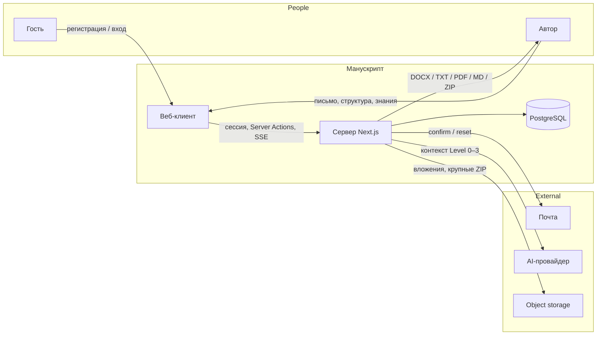
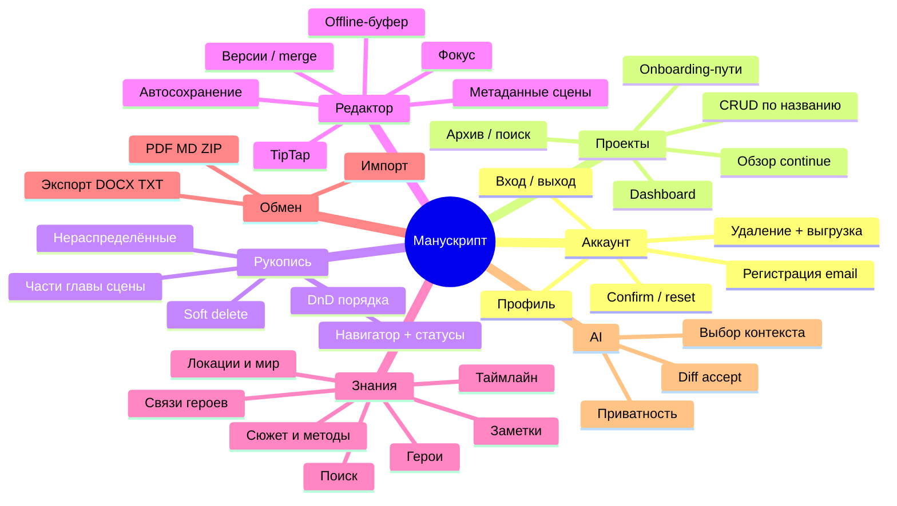
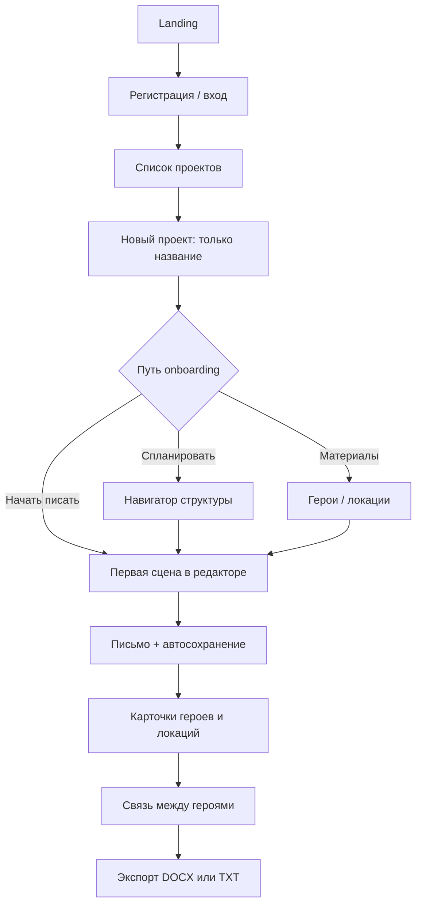
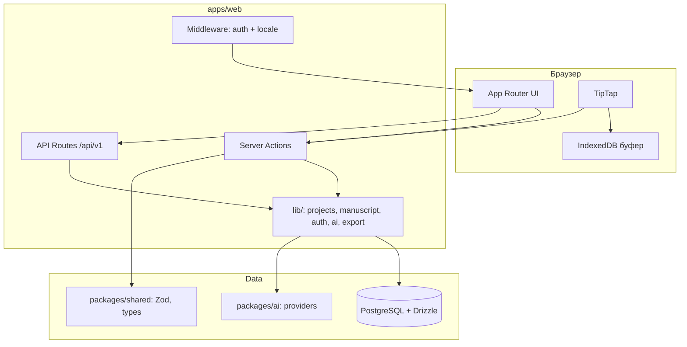
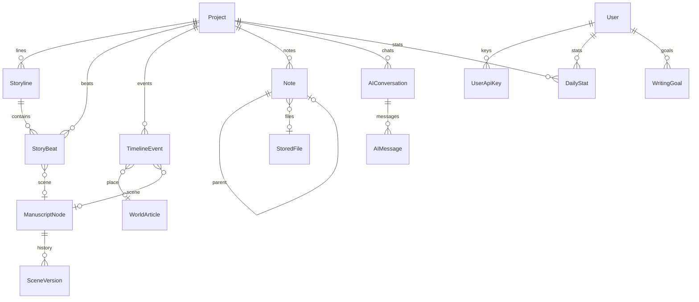

# Техническое задание — «Манускрипт»

> **Продукт:** «Манускрипт»  
> **Версия:** 1.2  
> **Дата:** 13 августа 2026  
> **Статус:** рабочая спецификация для разработки и приёмки  
> **Владелец:** Engineering  
> **Согласующие:** Product (scope), Design (UI), QA (приёмка)  
> **Основание:** [PRD v2.1](../prd/PRD.md), [BRD v1.1](../brd/BRD.md), [Use Cases](../user-stories/use-cases.md), [MVP Scope Matrix](../roadmap/MVP-SCOPE-MATRIX.md)  
> **Методика:** IEEE 830 (SRS) в изложении [«Ликбез по техническому заданию»](https://habr.com/ru/articles/490006/)  
> **Предыдущая версия:** 1.1

---

## Паспорт документа

| Поле | Значение |
|------|----------|
| Объект | Адаптивное веб-приложение «Манускрипт» (SaaS, desktop-first) |
| Горизонт ТЗ | Closed Alpha (P0 ядро) и MVP Beta (P0 + P1) |
| Платформа | Chromium / Gecko / WebKit, две последние стабильные версии |
| Языки UI | `ru`, `en` |
| SoT по приоритетам | [MVP Scope Matrix](../roadmap/MVP-SCOPE-MATRIX.md) |
| SoT по «что и зачем» | [PRD](../prd/PRD.md) |
| SoT по сценариям | [Use Cases](../user-stories/use-cases.md) |
| Живые справочники реализации | [technical/](../technical/) |

**Правило при расхождении**

| Вопрос | Побеждает |
|--------|-----------|
| Состав релиза, P0/P1/P2 | MVP Scope Matrix |
| Поведение для пользователя | PRD + Use Cases |
| Как реализовать, контракты, политики, НФТ с числами | **это ТЗ** |
| Фактическая схема/код «как сейчас» | Drizzle / `technical/` — с пометкой «факт» |

Утверждения без метки — **норматив ТЗ** (как должно быть). Расхождение с текущим кодом — backlog реализации, не отмена требования.

---

## 0. Как читать этот документ

Документ идёт от общего к частному (IEEE 830): зачем система существует → из каких частей состоит → как пользователь по ней движется → как это выглядит → как компоненты обмениваются данными → какие ограничения нельзя нарушить.

| Раздел | Аналог IEEE 830 / статья | Для кого |
|--------|--------------------------|----------|
| [1. Введение](#1-введение) | Purpose, scope, glossary | Все |
| [2. Концептуальная модель](#2-концептуальная-модель) | Overall description | Product, Eng |
| [3. Функциональная карта](#3-функциональная-карта) | Product functions | Eng, QA |
| [4. Путь пользователя](#4-путь-пользователя) | User flow + use cases | Design, QA, Eng |
| [5. Пользовательский интерфейс](#5-пользовательский-интерфейс) | External interfaces (UI) | Design, Eng |
| [6. Программные интерфейсы](#6-программные-интерфейсы) | Architecture, API, [модель БД](#65-модель-базы-данных) | Eng |
| [7. Нефункциональные требования](#7-нефункциональные-требования) | Performance, security, environment | Eng, QA, Ops |
| [8. Политики и инварианты](#8-политики-и-инварианты) | Design constraints | Eng, QA |
| [9. Приёмка](#9-приёмка-и-поставка) | Verification | QA, Product |

Детальные AC спринта — в [User Stories](../user-stories/). Это ТЗ не заменяет stories: оно задаёт проверяемые системные правила, на которые stories ссылаются.

---

## 1. Введение

### 1.1. Назначение

Зафиксировать технические требования к системе «Манускрипт», достаточные чтобы:

1. Реализовать MVP без скрытых договорённостей в чате.  
2. Принять работу по проверяемым критериям.  
3. Сменить исполнителя модуля, не восстанавливая контекст из переписки.

### 1.2. Объект и границы

**Входит в объём ТЗ:** fullstack веб-приложение (клиент + сервер + БД + интеграции), перечисленные в §3 функции приоритетов P0 и P1, НФТ, контракты API и модели данных, политики auth/импорта/экспорта/AI.

**Не входит (Won't / вне MVP):** книжная соцсеть, маркетплейс, типографская вёрстка, автопубликация, real-time соавторство, генерация целой книги одной командой, нативное mobile-приложение, пользовательские плагины, голосовой ввод, генерация изображений, визуальный граф отношений героев, OAuth/2FA/workspaces. См. [PRD §3.4](../prd/PRD.md).

**Компоненты продукта**

| Компонент | Кто использует | Назначение |
|-----------|----------------|------------|
| Веб-клиент | Автор | Письмо, структура, база знаний, экспорт, AI |
| Сервер приложения (`apps/web`) | Система | Auth, CRUD, автосохранение, оркестрация AI, экспорт |
| PostgreSQL | Система | Хранение аккаунтов и проектов |
| Transactional email | Автор | Confirm / reset (к Beta) |
| AI-провайдер | Автор косвенно | Контекстные предложения (P1) |
| Object storage | Автор | Вложения / крупные экспорты (P1, по мере Notes/Export) |

Админ-панель модерации **вне MVP**. Операции сопровождения — через БД, CI и хостинг, не через отдельный UI.

### 1.3. Термины

| Термин | Смысл |
|--------|--------|
| Автор | Аутентифицированный владелец своих проектов |
| Гость | Пользователь без сессии |
| Проект | Одна книга / рукопись в работе |
| Узел рукописи | `ManuscriptNode`: часть, глава или сцена |
| Сцена | Лист дерева; текст хранится отдельно от узла |
| База знаний | Герои, статьи мира (в т.ч. локации), связи, (P1) сюжет / таймлайн / заметки |
| Контекст AI | Явно выбранный набор сущностей, отправляемый в модель |
| P0 / P1 / P2 | Must Alpha / Should Beta / post-MVP |
| Soft delete | Запись скрыта (`deletedAt`), доступна к восстановлению |
| SoT | Source of truth — документ, побеждающий при расхождении |

### 1.4. Ссылки

- IEEE Std 830-1998 — Recommended Practice for Software Requirements Specifications  
- [Ликбез по ТЗ (Хабр)](https://habr.com/ru/articles/490006/)  
- [PRD](../prd/PRD.md) · [BRD](../brd/BRD.md) · [Use Cases](../user-stories/use-cases.md) · [Scope Matrix](../roadmap/MVP-SCOPE-MATRIX.md)  
- [ARCHITECTURE](../technical/ARCHITECTURE.md) · [DATABASE](../technical/DATABASE.md) · [API](../technical/API.md) · [CI-CD](../technical/CI-CD.md)  
- [Design handoff](../technical/design/) · [Decision Log](../roadmap/DECISION-LOG.md)  
- Figma: [Manuscript — Ink Studio](https://www.figma.com/design/DY4LOZnkponU6E1rmb34Fs/Manuscript-Ink-Studio)

### 1.5. Стек (факт, DEC-001 Accepted)

Next.js 15 (App Router) · TypeScript · PostgreSQL · Drizzle · Better Auth · TipTap (DEC-002 Proposed → целевой редактор) · next-intl · Tailwind · shadcn/ui · pnpm monorepo (`apps/web`, `packages/shared`, `packages/ai`).

---

## 2. Концептуальная модель

### 2.1. Краткое описание продукта

«Манускрипт» — спокойная desktop-first среда для авторов художественной прозы: проект книги, дерево частей/глав/сцен, карточки героев и локаций, связи между героями и редактор с автосохранением. К Beta добавляются методы построения сюжета, поиск по тексту, импорт и AI, который предлагает правки только по выбранному контексту и **не меняет текст без явного действия автора**.

Цель MVP: автор доходит до связного черновика и забирает рукопись файлом, не теряя введённый текст.

### 2.2. Аудитория

| Сегмент | Возраст / контекст | Что должно отразиться в системе |
|---------|-------------------|----------------------------------|
| Начинающий автор | Первая–вторая книга; чаще ru/en | Короткий onboarding, шаблоны методов к Beta, понятный next step |
| Автор-планировщик | Строит сюжет заранее | Дерево, доска, методы, связи героев |
| Автор-импровизатор | Начинает со сцены | Старт без мастера и без обязательного метода |

Основной контекст использования: длинные сессии в браузере на широком экране. Мобильный — ограниченный режим ([§7.1](#71-техническое-обеспечение), DEC-008).

### 2.3. Типы пользователей

| Тип | Ключевые отличия | MVP |
|-----|------------------|-----|
| Гость | Регистрация, вход, landing | Да |
| Автор | Полный CRUD своих проектов | Да |
| Соавтор / гость проекта | Совместный доступ | Нет (P2, `ProjectMember`) |
| Модератор / админ | Жалобы, блокировки | Нет |

Изоляция: автор видит **только** свои проекты. Любой запрос с `projectId` чужого пользователя → `403 FORBIDDEN` без утечки существования ресурса сверх необходимого.

### 2.4. Контекстная диаграмма (data flow)



Автор не общается с AI-провайдером напрямую: ключ платформы или (post-MVP / DEC-005) BYOK расшифровывается только на сервере, в логи не попадает.

---

## 3. Функциональная карта

Карта — полный набор пользовательских возможностей для оценки объёма. Приоритет и релиз-gate — в Scope Matrix; поведение — в PRD FR-* и Use Cases.



### 3.1. Модули и трассировка

| Модуль | Возможности | Приоритет | FR / UC |
|--------|-------------|-----------|---------|
| Auth | Регистрация, сессия; к Beta — confirm, reset, профиль, удаление | P0 | FR-AUTH-01…06 · UC-AUTH-01…06 |
| Проекты | CRUD, dashboard, onboarding, обзор | P0 | FR-PRJ-01…06 · UC-PRJ-01…03 |
| Рукопись | Дерево, статусы, DnD, soft delete, поиск названий | P0 | FR-MS-01…06 · UC-MS-01…02 |
| Редактор | TipTap, autosave, буфер, метаданные, фокус; версии к Beta | P0 | FR-ED-01…08 · UC-ED-01…04 |
| Знания Alpha | Герои, локации, статьи мира, связи героев, поиск названий | P0 | FR-KN-01…03a, 08, 10 · UC-KN-01…05 |
| Знания Beta | Сюжет/методы, таймлайн, заметки, полнотекст | P1 | FR-KN-04…07, 09 · UC-KN-06…09 |
| Экспорт Alpha | DOCX, TXT | P0 | FR-IO-01 · UC-IO-01 |
| Обмен Beta | PDF, MD, ZIP, импорт | P1 | FR-IO-02…03 · UC-IO-02…03 |
| AI | Контекст Level 0–3, diff, consent | P1 | FR-AI-01…04 · UC-AI-01 |
| Palette | Ctrl/Cmd+K | P1 | FR-ED-09 · UC-ED-05 |
| Статистика / цели | DailyStat, WritingGoal | P2 | DEC-012 |
| OAuth, collab, граф, BYOK | — | P2 | FR-AUTH-07, FR-AI-05 |

Командная палитра — P1; горячие клавиши редактора — P0 ([§5.5](#55-клавиатура)).

### 3.2. Вне MVP (явно)

OAuth, 2FA, workspaces, real-time collab, визуальный граф героев, визуальный таймлайн, AI Level 4–5, профиль стиля, BYOK как обязательный путь (схема `UserApiKey` может существовать — продукт P2 до DEC-005), биллинг.

---

## 4. Путь пользователя

Полные потоки, альтернативы и исключения — [use-cases.md](../user-stories/use-cases.md). Здесь — алгоритм работы с продуктом и детализация экранов.

### 4.1. Главный user flow (Alpha)



**Смысл пути:** гость становится автором → создаёт проект без длинной анкеты → пишет в связанной структуре → описывает героев и места → забирает текст с собой.

### 4.2. Возврат после перерыва

Автор открывает проект → видит последнюю сцену, прогресс и 1–3 следующих шага → одним действием продолжает письмо. Пустой проект не показывает ложный «% готовности» без цели по объёму.

### 4.3. User flow Beta (добавки)

После ядра Alpha автор может: выбрать метод сюжета (`blank` | `three-act` | `heros-journey` | `beat-sheet`); вести доску и таймлайн; искать по тексту; импортировать черновик; вызвать AI с видимым составом контекста и принять/отклонить diff.

### 4.4. Что можно сделать на ключевых экранах

| Экран | Действия пользователя |
|-------|------------------------|
| Регистрация | Ввести email и пароль; перейти ко входу; увидеть ошибки у поля |
| Вход | Войти; запросить сброс пароля (Beta); выйти из сессии |
| Dashboard | Создать / открыть / переименовать / дублировать / архивировать / удалить проект; искать по названию |
| Обзор проекта | Продолжить, увидеть next step, перейти в структуру / знания / экспорт |
| Навигатор | CRUD узлов, DnD, статусы, поиск по названиям, восстановление из корзины |
| Редактор | Писать, форматировать, фокус, метаданные, контекстная панель, синхронизация |
| Карточка героя | Имя + описание; связь со сценами; связи с другими героями |
| Экспорт | Выбрать формат и область; скачать файл |
| AI (Beta) | Выбрать Level 0–3; увидеть сущности; принять / частично / отклонить |

### 4.5. Индекс use case → реализация

| UC | Gate | Технический якорь |
|----|------|-------------------|
| UC-AUTH-01…02 | Alpha | Better Auth, cookie-сессия, middleware |
| UC-AUTH-03…06 | Beta | [§8.1](#81-аутентификация-и-аккаунт) |
| UC-PRJ-01…03 | Alpha | Server Actions проектов |
| UC-MS-01…02 | Alpha | `ManuscriptNode`, reorder, `deletedAt` |
| UC-ED-01…03 | Alpha | TipTap, autosave, IndexedDB-буфер |
| UC-ED-04 | Beta | snapshots + conflict UI |
| UC-KN-01…05 | Alpha | Character, WorldArticle, CharacterRelationship |
| UC-KN-06…09 | Beta | plot-methods, TimelineEvent, Note, FTS |
| UC-IO-01 | Alpha | [§8.4](#84-экспорт-и-импорт) |
| UC-IO-02…03 | Beta | ZIP-контракт, правила импорта |
| UC-AI-01 | Beta | [§8.5](#85-ai) |

---

## 5. Пользовательский интерфейс

Продукт должен работать и выглядеть спокойно: концентрация, минимум шума. Визуал не импровизируется в коде в обход дизайн-системы.

### 5.1. Референсы и стиль

| Источник | Роль |
|----------|------|
| [Manuscript — Ink Studio](https://www.figma.com/design/DY4LOZnkponU6E1rmb34Fs/Manuscript-Ink-Studio) | Норматив UI |
| [DESIGN-HANDOFF.md](../technical/design/DESIGN-HANDOFF.md) | Экран → frame → route → состояния |
| [FIGMA-VARIABLES.md](../technical/design/FIGMA-VARIABLES.md) | Токены (факт Figma) |
| `apps/web/src/app/globals.css` | Токены в коде; **отстаёт** от Ink Studio до DEC-011 |

**Стиль:** тёмный chrome (rail / навигатор / inspector) + светлый лист рукописи. Editorial, не Material и не геймификация. MVP — Light; Dark aliases есть в Figma, лист остаётся бумажным.

**Шрифты:** Geist — UI; Instrument Serif — display / названия; Newsreader — текст сцены; Geist Mono — счётчики, статусы, timestamps.

**Цвета (смысл):** ink `#0C0F12` для оболочки; paper `#F4EFE4` для листа; teal `#2F6F6A` акцент; `danger` только для опасных действий. Статусы сцен — **иконка + подпись**, не один цвет.

### 5.2. Каркас layout

| Breakpoint | Ширина | Поведение | Figma canvas |
|------------|--------|-----------|--------------|
| `desktop` | ≥1280px | Четыре зоны: **rail 64px** \| навигатор 260px \| лист (flex, ~65ch) \| inspector 320px | 1440 — [E.01](https://www.figma.com/design/DY4LOZnkponU6E1rmb34Fs/Manuscript-Ink-Studio?node-id=5-183) |
| `compact` | 900–1279px | Inspector скрыт, открывается по запросу; приоритет листа | 1024 — [E.01c](https://www.figma.com/design/DY4LOZnkponU6E1rmb34Fs/Manuscript-Ink-Studio?node-id=13-638) |
| `mobile` | <900px | **Только просмотр** сцены, навигация, поиск; rich-text **выключен** (DEC-008) | 390 — [E.01m](https://www.figma.com/design/DY4LOZnkponU6E1rmb34Fs/Manuscript-Ink-Studio?node-id=13-684) |

Редактор на mobile не монтирует TipTap в режиме редактирования. Навигация — icon rail, не широкий текстовый sidebar.

### 5.3. Экраны (карта)

P0: Landing, Login, Register, Dashboard (+ empty/loading/error), обзор проекта, редактор сцены (normal / empty / loading / focus / offline / conflict / deleted), герои (+ карточка и связи), мир (+ карточка локации), диалог создания проекта, экспорт.

P1: сюжетная доска, таймлайн, заметки, command palette, AI (контекст / diff / consent), поиск, импорт, профиль и настройки.

Точные Figma node-id и routes — [DESIGN-HANDOFF § Screen inventory](../technical/design/DESIGN-HANDOFF.md).

### 5.4. Состояния каждого P0-экрана

Обязательны: **normal · empty · loading · error · no-access/deleted**.  
Индикатор сохранения редактора: «Сохраняем…» / «Сохранено» / «Сохранено на устройстве» / «Конфликт» / «Ошибка — повторить».

### 5.5. Клавиатура

| Комбинация | Действие | Gate |
|------------|----------|------|
| Ctrl/Cmd+S | Немедленный flush автосохранения | P0 |
| Ctrl/Cmd+Shift+F | Режим фокуса | P0 |
| Alt/Option+↑/↓ | Соседняя сцена | P0 |
| Escape | Закрыть оверлеи / выйти из фокуса | P0 |
| Ctrl/Cmd+K | Command palette | P1 |
| Ctrl/Cmd+Z / Shift+Z | Undo / redo в редакторе | P0 |

### 5.6. Принципы поведения UI (продуктовые ограничения)

1. AI не вставляет текст без «Принять» / «Принять фрагмент».  
2. Прогрессивное раскрытие: глубина не блокирует старт.  
3. Контекст героев/локации рядом с текстом, не на отдельном «острове».  
4. Данные автора: статус синка всегда виден.

---

## 6. Программные интерфейсы

### 6.1. Архитектура

Клиент-серверное fullstack-приложение. Браузер отображает данные; сервер хранит их, проверяет права и выполняет побочные эффекты (почта, AI, файлы).



| Решение | Норматив |
|---------|----------|
| Мутации CRUD | Server Actions + Zod из `@manuscript/shared` |
| Стриминг AI | `POST /api/v1/ai/*`, SSE |
| Фоновые тяжёлые экспорты | Синхронно до порога; выше — job (BullMQ — если файл/таймаут не укладывается, P1) |
| Сессия | HTTP-only cookie, Secure, SameSite=Lax, Better Auth |

Живой обзор кода: [ARCHITECTURE.md](../technical/ARCHITECTURE.md). Если архитектура описывает BYOK как единственный путь AI — для Beta норматив ТЗ: **platform AI**, BYOK = P2 до принятия DEC-005.

### 6.2. Маршруты клиента (логические)

Префикс локали: `/[locale]/…`.

| Маршрут | Назначение |
|---------|------------|
| `/` | Landing |
| `/login`, `/register` | Auth |
| `/forgot-password`, `/reset-password` | Beta |
| `/projects` | Dashboard |
| `/projects/[id]` | Обзор |
| `/projects/[id]/scenes/[sceneId]` | Редактор |
| `/projects/[id]/characters`, `…/characters/[id]` | Герои |
| `/projects/[id]/world` | Мир / локации |
| `/projects/[id]/plot` | Сюжет (P1) |
| `/projects/[id]/timeline` | Таймлайн (P1) |
| `/projects/[id]/notes` | Заметки (P1) |
| `/settings` | Профиль / аккаунт (Beta) |

Защищённые маршруты без сессии → редирект на `/login` с `callbackUrl`.

### 6.3. API: общие правила

- Аутентификация: сессионная cookie. Без сессии → `401 UNAUTHORIZED`.  
- Авторизация: ресурс принадлежит `session.userId` (через `project.userId`). Иначе → `403 FORBIDDEN`.  
- Валидация: Zod на границе. Ошибка → `400 VALIDATION_ERROR`.  
- Идентификаторы: `cuid` / Better Auth id, непрозрачные.  
- Идемпотентность удалений: повторный delete уже soft-deleted узла — успех, не 500.

**Формат ошибки (REST и, где возможно, Actions):**

```json
{
  "error": {
    "code": "VALIDATION_ERROR",
    "message": "Title is required",
    "details": [{ "path": ["title"], "message": "Required" }]
  }
}
```

| Code | HTTP | Когда |
|------|------|--------|
| `UNAUTHORIZED` | 401 | Нет сессии |
| `FORBIDDEN` | 403 | Чужой проект / неподтверждённый email на ограниченном действии |
| `NOT_FOUND` | 404 | Нет сущности **в скоупе пользователя** |
| `VALIDATION_ERROR` | 400 | Zod / бизнес-валидация |
| `CONFLICT` | 409 | `SceneContent.version` не совпал |
| `EMAIL_NOT_VERIFIED` | 403 | Политика [§8.1](#81-аутентификация-и-аккаунт) |
| `EXPORT_FAILED` | 500 | Генерация файла; данные проекта целы |
| `AI_KEY_MISSING` | 400 | Нет platform-ключа / квоты (P1) |
| `AI_PROVIDER_ERROR` | 502 | Внешний провайдер |
| `PAYLOAD_TOO_LARGE` | 413 | Лимит импорта / файла |
| `RATE_LIMITED` | 429 | Лимит [§7.3](#73-производительность-и-квоты) |

Сообщения об ошибках — на языке UI (`ru`/`en`), без стека и SQL.

### 6.4. Контракты Server Actions (целевые)

Имена — логические. Реализация может жить в `lib/` и реэкспортироваться. Устаревшие `createChapter` / модель `Chapter` в [API.md](../technical/API.md) **не норматив** — норматив = `ManuscriptNode`.

#### Проекты

| Action | Вход | Выход | Правила |
|--------|------|-------|---------|
| `createProject` | `{ title }` | `Project` | `title` trim, 1…200; пустой не создаёт |
| `updateProject` | `{ id, title?, … }` | `Project` | Только владелец |
| `archiveProject` | `{ id }` | `Project` | `archivedAt`; скрыт в default-списке |
| `duplicateProject` | `{ id }` | `Project` | Копия дерева и знаний; исходник не меняется |
| `deleteProject` | `{ id }` | `{ ok: true }` | Подтверждение в UI; cascade |
| `listProjects` | `{ query?, includeArchived? }` | `Project[]` | Сортировка по `updatedAt` desc default |
| `getProjectOverview` | `{ id }` | обзор: continue scene, counts, next steps | |

Onboarding-путь — клиентский переход после `createProject`, не отдельная сущность.

#### Рукопись

| Action | Вход | Правила |
|--------|------|---------|
| `createNode` | `{ projectId, type, parentId?, title? }` | Иерархия: part⊃chapter⊃scene; сцена может быть без родителя (нераспределённая) |
| `renameNode` | `{ id, title }` | 1…200 |
| `reorderNodes` | `{ projectId, parentId, orderedIds }` | Все id — дети одного родителя; иначе валидация |
| `moveNode` | `{ id, newParentId, position }` | Нельзя сделать предка потомком себя |
| `setSceneStatus` | `{ id, status }` | Только `type=scene`; статус не блокирует редактирование |
| `softDeleteNode` | `{ id }` | Подтверждение; дети soft-delete вместе |
| `restoreNode` | `{ id }` | Из корзины проекта |
| `saveSceneContent` | `{ sceneId, contentJson, baseVersion }` | См. [§8.3](#83-редактор-и-сохранность-текста) |

#### Знания

| Action | Правила |
|--------|---------|
| `createCharacter` | Обязательно `name` (1…200). Опционально: `role`, `summary`, `appearance`, `motivation`, `notes`, `imageUrl` |
| `upsertCharacterRelationship` | Пара героев одного проекта; не сам с собой; уникальность `(a, b, type)` после канонизации [§8.2](#82-база-знаний) |
| `createWorldArticle` | Обязательно `title`; `type` из enum; локация = `location` |
| `linkCharacterToScene` / `unlink…` | Не каскадит удаление героя на текст сцены |
| `searchByTitle` | Скоуп = текущий проект; типы: nodes, characters, world |

P1: plot method, beats, timeline, notes, FTS — отдельные actions по той же схеме владения.

#### Экспорт / импорт / AI

См. [§8.4](#84-экспорт-и-импорт), [§8.5](#85-ai). REST для AI:

| Метод | Назначение | Ответ |
|-------|------------|-------|
| `POST /api/v1/ai/chat` | Чат с выбранным контекстом | SSE `{type:chunk\|done\|error}` |
| `POST /api/v1/ai/edit` | Правка выделения | SSE + затем diff в UI |
| `GET /api/v1/export` | Скачивание (или POST + job id) | файл / `application/zip` |

Тело AI-запроса **обязано** содержать `projectId`, `level` (0–3) и `contextEntityIds[]`. Сервер пересобирает контекст из БД; клиентскому «произвольному тексту всего проекта» нельзя доверять как единственному источнику.

### 6.5. Модель базы данных

Норматив схемы для реализации (IEEE 830: logical database requirements). Живой снимок кода: [DATABASE.md](../technical/DATABASE.md) и `apps/web/src/lib/db/schema.ts`. Если схема отстаёт — это gap, не отмена ТЗ.

СУБД: **PostgreSQL 16**. ORM: **Drizzle** ([DEC-013](../roadmap/DECISION-LOG.md#dec-013-orm-drizzle)). Идентификаторы доменных сущностей: `cuid` (`TEXT`). Время: `TIMESTAMPTZ`. JSON документов: `JSONB`.

#### 6.5.1. Соглашения

| Правило | Значение |
|---------|----------|
| PK | `id TEXT` (cuid), кроме 1:1 к сцене (`scene_id` = PK) |
| Обязательность | колонка без `?` / `NULL` — `NOT NULL` |
| Аудит | `created_at`, `updated_at` на всех доменных таблицах, кроме чистых join |
| Soft delete | `deleted_at TIMESTAMPTZ NULL`; выборки по умолчанию `WHERE deleted_at IS NULL` |
| Скоуп | любая сущность проекта несёт `project_id` и проверяется через `Project.user_id` |
| Строки | `title` / `name` — `VARCHAR(200)`; длинный текст — `TEXT` с лимитом в Zod |
| Счётчики | `INTEGER CHECK (>= 0)` |
| Порядок сиблингов | `position INTEGER`; гепы допустимы; сортировка `position, id` |
| Имена таблиц | PascalCase для доменных (`Project`, `ManuscriptNode`); Better Auth — `user`, `session`, `account`, `verification` |

**Легенда колонок:** Null = может быть NULL; Req = обязательна при INSERT; FK / PK / UQ — ключи.

#### 6.5.2. Карта таблиц по релизам

| Gate | Таблицы |
|------|---------|
| **P0 Alpha** | `user`, `session`, `account`, `verification` (Better Auth); `Project`; `ManuscriptNode`; `SceneContent`; `SceneMetadata`; `SceneParticipant`; `Character`; `CharacterRelationship`; `WorldArticle` |
| **P0 к Beta** | `SceneVersion` |
| **P1 Beta** | `Storyline`; `StoryBeat`; `TimelineEvent`; `Note`; `StoredFile`; `AIConversation`; `AIMessage` |
| **P2** | `ProjectMember`; `UserApiKey`; `DailyStat`; `WritingGoal`; `EntityLink` (только если явных FK не хватит) |

Каталог методов сюжета **не** хранится в БД: JSON в `packages/shared`. В проекте — поле `plot_method` и экземпляры `StoryBeat`.

#### 6.5.3. ER: ядро Alpha

```mermaid
erDiagram
  User ||--o{ Project : owns
  Project ||--o{ ManuscriptNode : tree
  ManuscriptNode ||--o| ManuscriptNode : parent
  ManuscriptNode ||--o| SceneContent : body
  ManuscriptNode ||--o| SceneMetadata : meta
  ManuscriptNode ||--o{ SceneParticipant : cast
  Project ||--o{ Character : heroes
  Project ||--o{ WorldArticle : world
  Project ||--o{ CharacterRelationship : relations
  Character ||--o{ SceneParticipant : appears
  Character ||--o{ CharacterRelationship : from
  Character ||--o{ CharacterRelationship : to
  SceneMetadata }o--o| Character : pov
  SceneMetadata }o--o| WorldArticle : location
  Project }o--o| ManuscriptNode : continue
```

#### 6.5.4. ER: Beta и P2



#### 6.5.5. Перечисления

| Enum | Значения | Где |
|------|----------|-----|
| `ProjectStatus` | `draft`, `in_progress`, `completed`, `archived` | Project |
| `PlotMethod` | `blank`, `three-act`, `heros-journey`, `beat-sheet` (+ Should из [plot-methods](../brd/plot-methods.md) позже) | Project |
| `ManuscriptNodeType` | `part`, `chapter`, `scene` | ManuscriptNode |
| `SceneStatus` | `idea`, `planned`, `draft`, `revision`, `ready` | ManuscriptNode (только scene) |
| `WorldArticleType` | `location`, `organization`, `object`, `rule`, `culture`, `event`, `article` | WorldArticle |
| `CharacterRoleHint` | не enum: свободная строка (`роль` автора) | Character.role |
| `RelationshipType` | `family`, `ally`, `enemy`, `romantic`, `mentor`, `other` | CharacterRelationship |
| `BeatStatus` | `idea`, `planned`, `draft`, `done` | StoryBeat |
| `TimelineDateMode` | `unspecified`, `relative`, `absolute` | TimelineEvent |
| `AiMessageRole` | `user`, `assistant`, `system` | AIMessage |
| `AiMessageStatus` | `ok`, `error`, `aborted` | AIMessage |
| `StoredFileKind` | `avatar`, `character`, `world`, `note`, `export` | StoredFile |
| `GoalType` | `daily`, `project` | WritingGoal (P2) |

#### 6.5.6. Identity (Better Auth)

Таблицы `user`, `session`, `account`, `verification` создаёт Better Auth. **Не переименовывать и не дублировать.** Ниже — используемые поля плюс расширения продукта.

**`user`**

| Поле | Тип | Null | Default | Ключ | Описание |
|------|-----|------|---------|------|----------|
| id | TEXT | нет | — | PK | ID Better Auth |
| email | TEXT | нет | — | UQ | Логин; при удалении аккаунта переписывается в tombstone, чтобы email освободить |
| name | TEXT | нет | `''` | | Отображаемое имя |
| image | TEXT | да | NULL | | URL аватара |
| emailVerified | BOOLEAN | нет | `false` | | Confirm (Beta) |
| locale | VARCHAR(8) | нет | `'ru'` | | `ru` \| `en` |
| aiConsentAt | TIMESTAMPTZ | да | NULL | | Момент согласия на AI (P1) |
| deletedAt | TIMESTAMPTZ | да | NULL | | Логическое удаление аккаунта |
| purgeAt | TIMESTAMPTZ | да | NULL | | Планируемое физическое удаление (+30 суток) |
| createdAt | TIMESTAMPTZ | нет | now() | | |
| updatedAt | TIMESTAMPTZ | нет | now() | | |

`session` / `account` / `verification` — как в текущей схеме (токены, пароль-хеш в `account.password`, TTL верификации). Продуктовые TTL ссылок — [§8.1](#81-аутентификация-и-аккаунт); хранение — `verification.expiresAt`.

#### 6.5.7. Проект

**`Project`** — одна книга. `description` из текущей схемы **не использовать** в новом коде: писать в `synopsis`.

| Поле | Тип | Null | Default | Ключ | Описание |
|------|-----|------|---------|------|----------|
| id | TEXT | нет | cuid | PK | |
| userId | TEXT | нет | — | FK → user.id ON DELETE CASCADE | Владелец |
| title | VARCHAR(200) | нет | — | | Единственное обязательное поле создания |
| subtitle | VARCHAR(200) | да | NULL | | |
| logline | VARCHAR(500) | да | NULL | | |
| synopsis | TEXT | да | NULL | | Синопсис; max 20_000 в Zod |
| genre | VARCHAR(100) | да | NULL | | Свободная строка |
| coverUrl | TEXT | да | NULL | | |
| plotMethod | VARCHAR(32) | нет | `'blank'` | | `PlotMethod`; Alpha всегда `blank` |
| targetWordCount | INTEGER | да | NULL | | Цель объёма; не даёт ложный % если NULL |
| totalWordCount | INTEGER | нет | `0` | | Кэш суммы сцен `deleted_at IS NULL` |
| status | ProjectStatus | нет | `draft` | | |
| continueNodeId | TEXT | да | NULL | FK → ManuscriptNode.id ON DELETE SET NULL | Последняя сцена для «Продолжить» |
| archivedAt | TIMESTAMPTZ | да | NULL | | Архив dashboard |
| deletedAt | TIMESTAMPTZ | да | NULL | | Soft delete проекта |
| createdAt | TIMESTAMPTZ | нет | now() | | |
| updatedAt | TIMESTAMPTZ | нет | now() | | |

Индексы: `(userId)`, `(userId, status)`, `(userId, updatedAt DESC)`.

Убрать из целевой модели: `templateId` (заменён `plotMethod`). Миграция: `templateId` → `plotMethod`, затем drop.

#### 6.5.8. Рукопись

**`ManuscriptNode`** — дерево: part → chapter → scene. Нераспределённая сцена: `type=scene` и `parentId NULL`.

| Поле | Тип | Null | Default | Ключ | Описание |
|------|-----|------|---------|------|----------|
| id | TEXT | нет | cuid | PK | |
| projectId | TEXT | нет | — | FK → Project CASCADE | |
| parentId | TEXT | да | NULL | FK → ManuscriptNode.id ON DELETE SET NULL | Корень / нераспределённая |
| type | ManuscriptNodeType | нет | — | | |
| title | VARCHAR(200) | нет | | | Пустое имя при создании — подставлять «Без названия» / i18n, не `''` как бизнес-пусто |
| position | INTEGER | нет | `0` | | Порядок среди сиблингов |
| status | SceneStatus | да | NULL | | **Только scene**; иначе NULL |
| synopsis | TEXT | да | NULL | | Кратко для навигатора; max 5_000 |
| wordCount | INTEGER | нет | `0` | | Кэш из `SceneContent.plainText`; у part/chapter можно хранить сумму детей (опционально, не блокер) |
| deletedAt | TIMESTAMPTZ | да | NULL | | Soft delete; дети помечаются тем же проходом |
| createdAt | TIMESTAMPTZ | нет | now() | | |
| updatedAt | TIMESTAMPTZ | нет | now() | | |

Индексы: `(projectId)`, `(projectId, parentId, position)`, `(projectId, type)`, `(projectId, deletedAt)`.

CHECK: `(type = 'scene') OR (status IS NULL)`.  
CHECK: `wordCount >= 0`.  
Приложение: нельзя сделать узел предком самого себя (проверка `moveNode`).

**`SceneContent`** — частый autosave, отделён от дерева.

| Поле | Тип | Null | Default | Ключ | Описание |
|------|-----|------|---------|------|----------|
| sceneId | TEXT | нет | — | PK, FK → ManuscriptNode.id CASCADE | Только `type=scene` |
| contentJson | JSONB | нет | `'{}'` | | TipTap doc, [§6.5.14](#6514-формат-contentjson) |
| plainText | TEXT | да | NULL | | Поиск, счётчик, AI |
| version | INTEGER | нет | `1` | | Optimistic concurrency; +1 при успешном save |
| updatedAt | TIMESTAMPTZ | нет | now() | | |

Индекс: GIN по `plainText` (P1 FTS, `to_tsvector('simple', plainText)` — язык смешанный ru/en).  
Триггер или сервис: INSERT/UPDATE только если node.type = `scene`. Создавать пустую строку при создании сцены.

**`SceneMetadata`** — цель/конфликт/POV; пишется независимо от текста.

| Поле | Тип | Null | Default | Ключ | Описание |
|------|-----|------|---------|------|----------|
| sceneId | TEXT | нет | — | PK, FK → ManuscriptNode CASCADE | |
| goal | TEXT | да | NULL | | Цель сцены |
| conflict | TEXT | да | NULL | | Конфликт |
| outcome | TEXT | да | NULL | | Исход |
| povCharacterId | TEXT | да | NULL | FK → Character ON DELETE SET NULL | POV |
| locationId | TEXT | да | NULL | FK → WorldArticle ON DELETE SET NULL | Локация (тип `location`) |
| storyTime | VARCHAR(200) | да | NULL | | Свободная метка («ночь третьего дня»), не ISO-обязательность |
| updatedAt | TIMESTAMPTZ | нет | now() | | |

При смене `locationId`: если статья не `type=location` — `VALIDATION_ERROR`. Строку создавать вместе со сценой или lazy при первом редактировании панели — допустимы оба; предпочтительно lazy.

**`SceneParticipant`** — герой в сцене.

| Поле | Тип | Null | Default | Ключ | Описание |
|------|-----|------|---------|------|----------|
| sceneId | TEXT | нет | — | PK, FK → ManuscriptNode CASCADE | |
| characterId | TEXT | нет | — | PK, FK → Character CASCADE | |
| sortOrder | INTEGER | нет | `0` | | Порядок в панели |
| createdAt | TIMESTAMPTZ | нет | now() | | |

PK = `(sceneId, characterId)`. Оба героя и сцена — одного `projectId` (проверка в сервисе; опционально составной FK через денормализацию `projectId`).

Рекомендуется колонка `projectId TEXT NOT NULL` + FK на Project для дешёвых запросов «все участия проекта» и защиты от cross-project link.

#### 6.5.9. База знаний (P0)

**`Character`**

| Поле | Тип | Null | Default | Ключ | Описание |
|------|-----|------|---------|------|----------|
| id | TEXT | нет | cuid | PK | |
| projectId | TEXT | нет | — | FK → Project CASCADE | |
| name | VARCHAR(200) | нет | — | | Обязательно; trim; пустое — не сохранять |
| role | VARCHAR(100) | да | NULL | | Роль в сюжете (свободный текст) |
| summary | TEXT | да | NULL | | Краткое описание; max 5_000 |
| appearance | TEXT | да | NULL | | Внешность; max 5_000 |
| motivation | TEXT | да | NULL | | Цель / мотивация; max 5_000 |
| notes | TEXT | да | NULL | | Заметки автора; max 20_000 |
| imageUrl | TEXT | да | NULL | | URL; P1 может указывать на StoredFile |
| extra | JSONB | да | NULL | | Поля PRD v1.0 сверх MVP (biography, fear, arc…) — не в UI Alpha |
| deletedAt | TIMESTAMPTZ | да | NULL | | |
| createdAt | TIMESTAMPTZ | нет | now() | | |
| updatedAt | TIMESTAMPTZ | нет | now() | | |

Индексы: `(projectId)`, `(projectId, name)`.

**`CharacterRelationship`**

| Поле | Тип | Null | Default | Ключ | Описание |
|------|-----|------|---------|------|----------|
| id | TEXT | нет | cuid | PK | |
| projectId | TEXT | нет | — | FK → Project CASCADE | |
| fromCharacterId | TEXT | нет | — | FK → Character CASCADE | |
| toCharacterId | TEXT | нет | — | FK → Character CASCADE | |
| type | RelationshipType | нет | — | | |
| label | VARCHAR(100) | да | NULL | | Обязателен, если `type=other` |
| comment | TEXT | да | NULL | | Max 2_000 |
| symmetric | BOOLEAN | нет | `true` | | `true` — одна сущность на обеих карточках |
| createdAt | TIMESTAMPTZ | нет | now() | | |
| updatedAt | TIMESTAMPTZ | нет | now() | | |

CHECK: `fromCharacterId <> toCharacterId`.  
CHECK: `type <> 'other' OR label IS NOT NULL`.  
Уникальность: `(fromCharacterId, toCharacterId, type)`. Для `symmetric=true` перед записью канонизировать пару: `fromId < toId` лексикографически — иначе дубликат A→B и B→A.  
Оба персонажа принадлежат `projectId`. Визуальный граф таблиц не требует.

**`WorldArticle`**

| Поле | Тип | Null | Default | Ключ | Описание |
|------|-----|------|---------|------|----------|
| id | TEXT | нет | cuid | PK | |
| projectId | TEXT | нет | — | FK → Project CASCADE | |
| type | WorldArticleType | нет | `'article'` | | Локация = `location` |
| title | VARCHAR(200) | нет | — | | Обязательно |
| summary | TEXT | да | NULL | | Max 5_000 |
| contentJson | JSONB | нет | `'{}'` | | Длинное описание (тот же doc-формат или простой `{type:'doc', content:[{type:'paragraph',...}]}`) |
| imageUrl | TEXT | да | NULL | | |
| extra | JSONB | да | NULL | | Теги и расширение |
| deletedAt | TIMESTAMPTZ | да | NULL | | |
| createdAt | TIMESTAMPTZ | нет | now() | | |
| updatedAt | TIMESTAMPTZ | нет | now() | | |

Индексы: `(projectId)`, `(projectId, type)`, `(projectId, title)`.

#### 6.5.10. Сюжет, таймлайн, заметки (P1)

**`Storyline`**

| Поле | Тип | Null | Default | Ключ | Описание |
|------|-----|------|---------|------|----------|
| id | TEXT | нет | cuid | PK | |
| projectId | TEXT | нет | — | FK CASCADE | |
| title | VARCHAR(200) | нет | — | | |
| description | TEXT | да | NULL | | |
| colorToken | VARCHAR(32) | да | NULL | | Токен дизайн-системы, не произвольный hex в MVP |
| status | VARCHAR(32) | да | NULL | | Свободный/простой статус линии |
| position | INTEGER | нет | `0` | | |
| deletedAt | TIMESTAMPTZ | да | NULL | | |
| createdAt / updatedAt | TIMESTAMPTZ | нет | now() | | |

**`StoryBeat`** — экземпляр шага метода или карточка доски.

| Поле | Тип | Null | Default | Ключ | Описание |
|------|-----|------|---------|------|----------|
| id | TEXT | нет | cuid | PK | |
| projectId | TEXT | нет | — | FK CASCADE | |
| storylineId | TEXT | да | NULL | FK → Storyline SET NULL | |
| sceneId | TEXT | да | NULL | FK → ManuscriptNode SET NULL | Связь бита со сценой |
| templateKey | VARCHAR(64) | да | NULL | | Ключ из JSON метода (`act1-setup`, `hj-call`, …); NULL = свободная карточка |
| title | VARCHAR(200) | нет | — | | |
| description | TEXT | да | NULL | | |
| position | INTEGER | нет | `0` | | |
| status | BeatStatus | нет | `idea` | | |
| deletedAt | TIMESTAMPTZ | да | NULL | | |
| createdAt / updatedAt | TIMESTAMPTZ | нет | now() | | |

Смена `Project.plotMethod` не удаляет сцены. Биты со старым `templateKey` можно архивировать (`deletedAt`) и посеять новый набор — с предупреждением в UI ([§8.6](#86-прочие-инварианты)).

**`TimelineEvent`**

| Поле | Тип | Null | Default | Ключ | Описание |
|------|-----|------|---------|------|----------|
| id | TEXT | нет | cuid | PK | |
| projectId | TEXT | нет | — | FK CASCADE | |
| title | VARCHAR(200) | нет | — | | |
| description | TEXT | да | NULL | | |
| dateMode | TimelineDateMode | нет | `relative` | | |
| absoluteStart | VARCHAR(64) | да | NULL | | Свободная дата мира, не обязательно ISO |
| absoluteEnd | VARCHAR(64) | да | NULL | | |
| relativeOrder | INTEGER | нет | `0` | | Порядок «story time»; конфликт порядка — warning, не hard-block |
| locationId | TEXT | да | NULL | FK → WorldArticle SET NULL | |
| sceneId | TEXT | да | NULL | FK → ManuscriptNode SET NULL | |
| deletedAt | TIMESTAMPTZ | да | NULL | | |
| createdAt / updatedAt | TIMESTAMPTZ | нет | now() | | |

Индекс: `(projectId, relativeOrder)`.

**`Note`**

| Поле | Тип | Null | Default | Ключ | Описание |
|------|-----|------|---------|------|----------|
| id | TEXT | нет | cuid | PK | |
| projectId | TEXT | нет | — | FK CASCADE | |
| parentId | TEXT | да | NULL | FK → Note SET NULL | Вложенность |
| title | VARCHAR(200) | нет | — | | |
| contentJson | JSONB | нет | `'{}'` | | |
| url | TEXT | да | NULL | | Внешняя ссылка |
| tags | TEXT[] | нет | `'{}'` | | |
| deletedAt | TIMESTAMPTZ | да | NULL | | |
| createdAt / updatedAt | TIMESTAMPTZ | нет | now() | | |

Связь заметки с героем/сценой — опционально `entityType VARCHAR(32)` + `entityId TEXT` (без универсального EntityLink в MVP).

**`StoredFile`** (P1 вложения; квоты DEC-010)

| Поле | Тип | Null | Default | Ключ | Описание |
|------|-----|------|---------|------|----------|
| id | TEXT | нет | cuid | PK | |
| userId | TEXT | нет | — | FK → user CASCADE | Квота владельца |
| projectId | TEXT | да | NULL | FK → Project CASCADE | NULL = аватар аккаунта |
| kind | StoredFileKind | нет | — | | |
| storageKey | TEXT | нет | — | UQ | Ключ в object storage |
| mime | VARCHAR(100) | нет | — | | Белый список |
| sizeBytes | INTEGER | нет | — | | |
| createdAt | TIMESTAMPTZ | нет | now() | | |

#### 6.5.11. Версии сцен (P0 к Beta)

**`SceneVersion`** — полный снимок, не delta.

| Поле | Тип | Null | Default | Ключ | Описание |
|------|-----|------|---------|------|----------|
| id | TEXT | нет | cuid | PK | |
| sceneId | TEXT | нет | — | FK → ManuscriptNode CASCADE | |
| version | INTEGER | нет | — | | Значение `SceneContent.version` на момент снимка |
| contentJson | JSONB | нет | — | | |
| plainText | TEXT | да | NULL | | |
| createdAt | TIMESTAMPTZ | нет | now() | | |

Уникальность `(sceneId, version)`. Не писать снимок, если JSON идентичен предыдущему. Хранить последние **N=50** на сцену; старше — удалять фоном (не блокер UI). Restore копирует snapshot в `SceneContent` и инкрементирует version.

#### 6.5.12. AI (P1)

**`AIConversation`**

| Поле | Тип | Null | Default | Ключ | Описание |
|------|-----|------|---------|------|----------|
| id | TEXT | нет | cuid | PK | |
| projectId | TEXT | нет | — | FK CASCADE | Каскад при удалении проекта |
| sceneId | TEXT | да | NULL | FK SET NULL | |
| title | VARCHAR(200) | да | NULL | | |
| retainMessages | BOOLEAN | нет | `true` | | Toggle «не сохранять»; при `false` сообщения не пишутся |
| createdAt / updatedAt | TIMESTAMPTZ | нет | now() | | |

**`AIMessage`**

| Поле | Тип | Null | Default | Ключ | Описание |
|------|-----|------|---------|------|----------|
| id | TEXT | нет | cuid | PK | |
| conversationId | TEXT | нет | — | FK → AIConversation CASCADE | |
| role | AiMessageRole | нет | — | | |
| content | TEXT | нет | — | | Текст **сообщения чата**, не полный промпт с рукописью |
| contextLevel | SMALLINT | нет | `0` | | 0–3 |
| contextEntityIds | JSONB | нет | `'[]'` | | `{ type, id }[]` — metadata only |
| model | VARCHAR(64) | да | NULL | | |
| status | AiMessageStatus | нет | `ok` | | |
| errorCode | VARCHAR(64) | да | NULL | | Без тела провайдера |
| createdAt | TIMESTAMPTZ | нет | now() | | |

Хранить последние 50 сообщений на conversation (DEC-006). **Запрещено:** колонка с собранным system prompt, полный текст сцен, ключи API.

#### 6.5.13. Post-MVP (P2) — зарезервировать, не реализовывать в Alpha

**`ProjectMember`:** `projectId`, `userId`, `role` (`owner|editor|commenter`), `invitedAt`, `acceptedAt`. Unique `(projectId, userId)`.

**`UserApiKey`:** как в текущей схеме: `userId`, `provider`, `encryptedKey` (AES-256-GCM), `keyHint`, `model`. Unique `(userId, provider)`.

**`DailyStat`:** unique `(userId, projectId, date)`; `wordsWritten`. Не обновлять в Alpha.

**`WritingGoal`:** `type`, `targetWords`, `userId`, `projectId?`.

**`EntityLink`:** универсальные связи `sourceType/sourceId → targetType/targetId` + `relationType`. В MVP не нужен: достаточно SceneParticipant, CharacterRelationship, SceneMetadata, Note.entity*.

#### 6.5.14. Формат `contentJson`

DEC-003, целевой. Корень: `{ "type": "doc", "content": [ ... ] }`.

Разрешённые nodes: `doc`, `paragraph`, `heading` (`attrs.level` 2 или 3), `bulletList`, `orderedList`, `listItem`, `horizontalRule`, `text`.  
Marks: `bold`, `italic`, `strike`.

Round-trip: edit → save → reload → эквивалентный JSON (стабильная сериализация TipTap). Иные node types при импорте — unwrap в paragraph или drop с записью в отчёт импорта, не 500.

#### 6.5.15. Целостность, каскады, кэши

| Событие | Поведение |
|---------|-----------|
| Удаление User (purge) | CASCADE проектов и всего скоупа |
| Soft delete Project | `deletedAt`; в UI скрыт; hard purge по `purgeAt` аккаунта |
| Soft delete Character | CASCADE join: участники и relationships; текст сцен и SceneMetadata.pov → SET NULL |
| Soft delete WorldArticle | SceneMetadata.locationId и TimelineEvent.locationId → SET NULL |
| Soft delete Node | `deletedAt` на узле и потомках; SceneContent сохраняется (для restore) |
| Restore Node | снять `deletedAt` с узла; детей — если были удалены тем же действием (хранить не обязательно: restore ветки целиком) |
| Save SceneContent | пересчёт `ManuscriptNode.wordCount`; `Project.totalWordCount` = SUM сцен без deleted |
| Cross-project FK | запрещён на уровне сервиса; для join-таблиц дублировать `projectId` |

`ON DELETE` для FK на soft-delete сущности: **SET NULL** или запрет, не hard CASCADE сцены из-за удаления героя.

#### 6.5.16. Gap относительно текущей схемы

| Требование ТЗ | Факт `schema.ts` (на дату) |
|---------------|------------------------------|
| Character: appearance, motivation, notes, extra | нет |
| CharacterRelationship, SceneMetadata, SceneParticipant | нет |
| Project.plotMethod, continueNodeId, deletedAt | нет (`templateId`, `description` legacy) |
| user.deletedAt, purgeAt, aiConsentAt, locale уже есть | locale есть; deleted/purge/consent нет |
| SceneVersion, сюжет/таймлайн/заметки/AI | нет |
| UserApiKey, DailyStat, WritingGoal | есть, **P2 / не включать в Alpha-потоки** |

Порядок миграций: Sprint 3 — SceneContent.version (уже есть) + SceneMetadata + SceneVersion к Beta; Sprint 4 — поля Character + Relationship + Participant + plotMethod; Sprint 5–6 — P1 таблицы.

### 6.6. Интеграции

| Система | Протокол | Gate | Правило |
|---------|----------|------|---------|
| SMTP / transactional email | API провайдера | Beta | Confirm и reset; не логировать токены |
| AI | HTTPS REST + SSE | P1 | Контекст только выбранный; timeout 30 с |
| Object storage | S3-совместимый | P1 файлы | Signed URL; публичного bucket для рукописей нет |
| OAuth Google/Apple | OIDC | P2 | — |

Аналитика: только имена событий из [PRD §9.2](../prd/PRD.md). **Текст рукописи, промпты и ответы AI в аналитику не пишутся.**

---

## 7. Нефункциональные требования

Идентификаторы совместимы с PRD NFR-01…13; ниже — техническая детализация и пороги.

### 7.1. Техническое обеспечение

| ID | Требование | Проверка |
|----|------------|----------|
| TZ-ENV-01 | Desktop-браузеры: две последние стабильные Chrome, Edge, Firefox, Safari | Smoke-матрица |
| TZ-ENV-02 | JS обязателен; без IE | — |
| TZ-ENV-03 | Viewport ≥1280 — полный UX; 900–1279 — compact; <900 — read-only | QA ширин |
| TZ-ENV-04 | Node.js и Next.js — версии lockfile репозитория; PostgreSQL 16 | CI |
| TZ-ENV-05 | Локаль UI `ru` \| `en`; P0-потоки без сырых i18n-ключей | Проход двух локалей |
| TZ-ENV-06 | Окружения: `local`, `preview` (PR), `staging`, `production` | CI/CD |
| TZ-ENV-07 | Секреты только в env: `DATABASE_URL`, `BETTER_AUTH_SECRET`, `ENCRYPTION_SECRET`, ключи почты/AI | Review |

Полный offline всего проекта — **вне MVP**. Offline редактора = локальный буфер текущей сцены ([§8.3](#83-редактор-и-сохранность-текста)).

### 7.2. Безопасность

| ID | Требование | Проверка |
|----|------------|----------|
| TZ-SEC-01 | TLS 1.2+ на всех внешних endpoint | Staging/prod |
| TZ-SEC-02 | Пароли — алгоритм Better Auth (scrypt / argon2id). Запрещены SHA-1/MD5 для паролей | Review |
| TZ-SEC-03 | Политика пароля: ≥8 символов, не пустой trim; tip сложности — в UI, не блокирует кроме минимума | Тест |
| TZ-SEC-04 | Сессии: HTTP-only, Secure (prod), SameSite=Lax; logout и смена пароля инвалидируют сессии | Тест |
| TZ-SEC-05 | Изоляция данных по `userId` / `projectId` на каждом серверном методе | Security review |
| TZ-SEC-06 | Нет enumeration email на reset: одинаковый UX «если аккаунт есть — письмо отправлено» | Тест |
| TZ-SEC-07 | Загрузка файлов: белый список MIME, лимит размера, без executable | Тест |
| TZ-SEC-08 | CSRF — штатная защита Next.js / Better Auth | Review |
| TZ-SEC-09 | Вход: не более 5 неудачных попыток / 10 мин / IP+email, затем `RATE_LIMITED` | Тест |
| TZ-SEC-10 | Рукопись и AI-промпты не пишутся в application logs и analytics | Review + grep логов |
| TZ-SEC-11 | Удаление аккаунта — [§8.1](#81-аутентификация-и-аккаунт) | QA |
| TZ-SEC-12 | BYOK-ключи (если включены) — AES-256-GCM, hint из 4 символов, ключ не в клиентском storage | Review |

### 7.3. Производительность и квоты

| ID | Требование | Проверка |
|----|------------|----------|
| NFR-01 / TZ-PERF-01 | Открытие последнего проекта, p75 ≤ 2,5 с на типовом проекте staging | Замер |
| NFR-02 / TZ-PERF-02 | Отклик ввода в редакторе ≤ 50 мс; ввод не ждёт сеть | Профиль / offline |
| NFR-03 / TZ-PERF-03 | Автосохранение не блокирует клавиатуру | UX |
| NFR-04 / TZ-PERF-04 | Поиск по среднему проекту ≤ 1 с | Замер |
| TZ-PERF-05 | Debounce автосохранения **2000 мс** после последнего ввода; Ctrl+S — сразу | Тест |
| TZ-PERF-06 | Типовой проект для замеров: ≥20 сцен, ≥15k слов суммарно | Фикстура |
| TZ-PERF-07 | Таймаут AI-запроса 30 с; редактор полностью работает при отказе AI | Тест |
| TZ-PERF-08 | Экспорт Alpha (DOCX/TXT) до 200 сцен — синхронно, целевой p75 ≤ 10 с | Замер |
| TZ-QUOTA-01 | Импорт DOCX/TXT/MD ≤ 10 МБ; ZIP ≤ 50 МБ | Тест 413 |
| TZ-QUOTA-02 | Вложения (P1, draft DEC-010): файл ≤ 5 МБ; JPEG/PNG/WebP/GIF; 50 МБ/проект до тарифов | Тест |
| TZ-QUOTA-03 | AI (P1, до DEC-004): черновая квота platform 50 запросов/сутки/пользователь; сверх — понятная ошибка | Тест |

### 7.4. Надёжность и доступность

| ID | Требование |
|----|------------|
| NFR-05 / TZ-REL-01 | Нет потери **подтверждённого** текста (успешный sync или явный локальный буфер). Kill tab / offline 5 мин → текст восстанавливается |
| TZ-REL-02 | Конфликт версий не затирает молча (Beta): UI merge / выбор версии |
| NFR-06 / TZ-REL-03 | К Beta: ежедневный backup БД; мониторинг ошибок клиента/сервера; алерт `scene_autosave_failed` |
| TZ-REL-04 | Ошибка экспорта/AI не портит `SceneContent` |
| TZ-REL-05 | Деплой: rollback без затирания пользовательских данных; миграции Drizzle только вперёд совместимые на gate |

CI на каждый PR: install, typecheck, lint, schema apply, build — [CI-CD.md](../technical/CI-CD.md).

### 7.5. Доступность, i18n, приватность

| ID | Требование |
|----|------------|
| NFR-09 | WCAG 2.1 AA на P0-экранах к **Beta**; критичные потоки полностью с клавиатуры |
| NFR-11 | Desktop-first, mobile read-only |
| NFR-12 | ru/en |
| NFR-13 | Рукопись не идёт в обучение модели без явного согласия; consent до первого AI-запроса (DEC-006/007) |

---

## 8. Политики и инварианты

Этот раздел закрывает правила, которые продуктовые документы оставляли на ТЗ.

### 8.1. Аутентификация и аккаунт

**Регистрация (Alpha).** Email + пароль. Успех → сессия и вход в приложение. Confirm email **не** блокирует письмо в Alpha.

**Подтверждение email (Beta, FR-AUTH-03).**

- Один активный токен на пользователя; повторная отправка **инвалидирует** предыдущую ссылку.  
- TTL ссылки: **24 часа**.  
- Без подтверждения доступны: проекты, структура, редактор, знания, экспорт **текущего проекта** (DOCX/TXT/PDF/MD).  
- Без подтверждения **запрещены:** AI, удаление аккаунта, выгрузка **всего** аккаунта, смена email.  
- В шапке — постоянный баннер «Подтвердите почту» + повторная отправка.  
- Код отказа: `EMAIL_NOT_VERIFIED`.

**Сброс пароля (Beta).** TTL ссылки **1 час**; один активный токен. Успех → все сессии пользователя инвалидируются → вход с новым паролем. Enumeration запрещён ([TZ-SEC-06](#72-безопасность)).

**Удаление аккаунта (Beta).**

1. Не один клик: ввод пароля **или** ввод email аккаунта в поле подтверждения.  
2. Система предлагает выгрузку данных (ZIP аккаунта).  
3. Если выгрузка **не удалась** — удаление **не** выполняется. Автор может повторить выгрузку **или** явно выбрать «Удалить без выгрузки» (второй чекбокс + повторный ввод email).  
4. После успеха: сессии убиты, вход невозможен, проекты недоступны. Физическое удаление контента — в течение **30 суток** (окно legal hold / ошибочного удаления оператором).  
5. Ошибка шага 4 → аккаунт остаётся рабочим.

### 8.2. База знаний

- Герой без имени не сохраняется; пустые опциональные поля допустимы.  
- Локация — `WorldArticle.type = location`; прочие типы статей — тот же CRUD.  
- Связь героев: предустановки `family`, `ally`, `enemy`, `romantic`, `mentor`, `other` (+ `label`).  
- Симметричная связь (`symmetric=true`) видна на обеих карточках как одна сущность.  
- Дубликат той же канонической пары + `type` → обновление `comment`, не вторая строка.  
- Визуальный граф — не делать в MVP.  
- Удаление героя/статьи — подтверждение; участники сцен снимаются, текст сцен не удаляется.

### 8.3. Редактор и сохранность текста

```
onChange → debounce 2000ms → IndexedDB (sceneId) → Server Action saveSceneContent
Ctrl+S / blur длинной паузы → немедленный flush
```

1. `contentJson` + `plainText` считаются на клиенте; `wordCount` узла и `Project.totalWordCount` — на сервере при успешном save (сумма scene-узлов, не deleted).  
2. Optimistic concurrency: клиент шлёт `baseVersion`; сервер при равенстве пишет и делает `version+1`. Иначе `409 CONFLICT`.  
3. Alpha: при конфликте побеждает **сервер + toast «есть более новая версия»** и кнопка «Загрузить с сервера» / «Оставить моё» (явный выбор, не тихий overwrite).  
4. Beta: история снимков (не реже чем раз в успешный save с изменением текста, с дедупом если JSON идентичен) + UI восстановления; merge UX как gate Beta.  
5. Offline: писать можно; статус «Сохранено на устройстве»; по появлению сети — flush очереди одной сцены.  
6. Статусы сцены не блокируют ввод.

Разрешённые marks/nodes — [§6.5.14](#6514-формат-contentjson).

### 8.4. Экспорт и импорт

**Область экспорта:** весь проект, одна часть, набор сцен (id). Пустой набор → валидация, файл не создаётся.

**Alpha:** DOCX и TXT. Порядок узлов — дерево `position`. TXT: заголовки уровней и пустая строка между сценами. DOCX: те же уровни заголовков, базовые marks.

**Beta доп. форматы:** PDF (печатная вёрстка не требуется: читаемый текст + оглавление), Markdown, ZIP.

#### Контракт ZIP (`manuscript-export` v1)

Машиночитаемый архив для повторного импорта.

```
manifest.json
manuscript/tree.json
manuscript/scenes/{sceneId}.json
characters/{characterId}.json
relationships.json
world/{articleId}.json
meta/scenes/{sceneId}.json
```

`manifest.json`:

```json
{
  "format": "manuscript-export",
  "version": 1,
  "exportedAt": "2026-08-13T12:00:00.000Z",
  "locale": "ru",
  "project": {
    "title": "…",
    "subtitle": null,
    "logline": null,
    "synopsis": null,
    "genre": null,
    "plotMethod": "blank"
  }
}
```

- `tree.json` — массив узлов: `id`, `parentId`, `type`, `title`, `position`, `status`, `synopsis`.  
- Файл сцены: `{ "contentJson": {}, "plainText": "…" }`.  
- Кодировка UTF-8. Имена файлов = id сущностей.  
- Вложения (P1) — `files/{id}` + ссылки в notes; если файлов нет, каталога может не быть.

**Импорт (P1).**

| Источник | Поведение |
|----------|-----------|
| TXT / вставка | Одна новая сцена в выбранной главе или «нераспределённые»; preview |
| Markdown / DOCX | Заголовки: H1→part, H2→chapter, H3+→scene; без заголовков — одна сцена |
| ZIP v1 | Новый проект **или** импорт в пустой только что созданный; id **генерируются заново** (коллизий с текущей БД нет) |

Идемпотентность: **один** подтверждённый импорт создаёт каждую сущность из файла один раз. Повторная загрузка того же файла — **новая копия** только после явного «Импортировать ещё раз» на preview. Тихого merge по названию нет. Отмена preview не меняет проект.

Лимиты размера — [TZ-QUOTA-01](#73-производительность-и-квоты). Битый файл → ошибка, данные целы.

### 8.5. AI

Уровни контекста (норматив, PRD v1.0 §26.2):

| Level | Состав | MVP |
|-------|--------|-----|
| 0 | Только сообщение пользователя | P1 |
| 1 | Выделенный текст | P1 |
| 2 | Текущая сцена + метаданные | P1 |
| 3 | Связанные герои, локация сцены, сюжетные линии | P1 |
| 4–5 | Главы / весь проект | P2, запрещено без отдельного confirm |

Правила:

- До отправки UI показывает список сущностей контекста.  
- Сервер сам загружает текст сущностей; клиент не может расширить level.  
- Ответ — предложение: «Принять» / «Принять фрагмент» / «Отклонить». Без accept текст сцены не меняется.  
- AI не создаёт и не удаляет сущности и не меняет `status` сцены.  
- История чата — последние 50 сообщений (DEC-006 draft); toggle «не сохранять»; удаление проекта каскадит AI-таблицы.  
- Отказ провайдера — ошибка в панели; редактор жив.

### 8.6. Прочие инварианты

1. Soft delete узлов: корзина проекта; hard delete — вне UI MVP (оператор/retention).  
2. `position`: гепы допустимы; канонический порядок — `ORDER BY position, id`.  
3. Счётчик слов: Unicode words по `plainText` (единый util в `packages/shared`); не блокирует ввод при расхождении на 1–2 слова во время debounce.  
4. Смена `plotMethod` не удаляет текст сцен; каркас битов можно пересоздать с предупреждением.  
5. Feature flags: AI и импорт выключаемы на Beta без деплоя кода (env/flag).

---

## 9. Приёмка и поставка

### 9.1. Этапы

| Этап | Результат | Критерий |
|------|-----------|----------|
| Phase 0 | Документация, monorepo, CI, схема | Инфра готова |
| Phase 1 Closed Alpha | P0 ядро | [§9.2](#92-closed-alpha) |
| Phase 2 MVP Beta | P0 + P1 | [§9.3](#93-mvp-beta) |
| Phase 3 Launch | Тарифы, OAuth по плану, legal | DEC-004, DEC-007 |
| Phase 4 | P2 | Backlog |

Спринты: [ROADMAP](../roadmap/ROADMAP.md).

### 9.2. Closed Alpha

Автор проходит без потери текста при кратком offline:

**регистрация → проект → структура → сцена → описание героя и локации → связь между героями → экспорт DOCX/TXT.**

Не требуется: AI, plot board, методы кроме `blank`, timeline, import, full-text, billing, confirm email.

Чеклист ТЗ:

- [ ] Все P0 Alpha из Scope Matrix реализованы или явно сняты Product  
- [ ] UC Alpha закрыты по исключениям (данные не портятся)  
- [ ] TZ-REL-01 выполнен на типовом сценарии  
- [ ] Нет дыр изоляции проектов  
- [ ] `technical/` обновлён для изменённых модулей

### 9.3. MVP Beta

- [ ] 100% P0+P1 Scope Matrix  
- [ ] Политики §8.1, §8.4, §8.5  
- [ ] WCAG AA на P0-экранах  
- [ ] Privacy + AI consent  
- [ ] Backup и мониторинг  
- [ ] ≥70% тестовых авторов до первой сохранённой сцены; usability ≥5 авторов (продуктовые ворота PRD §12.2)

### 9.4. Критерии готовности изменения (Definition of Done)

1. Поведение соответствует FR/UC и этому ТЗ.  
2. Zod-схема и проверка владельца на сервере.  
3. Состояния empty/loading/error для затронутого экрана.  
4. i18n ru/en.  
5. CI зелёный.  
6. При изменении модели — миграция Drizzle и правка [DATABASE.md](../technical/DATABASE.md).  
7. При изменении контракта — правка [API.md](../technical/API.md).

---

## 10. Открытые зависимости

Решения, которые ТЗ принимает как черновик до Accepted в Decision Log:

| DEC | Как ТЗ действует до sign-off |
|-----|------------------------------|
| DEC-002 TipTap | Считать целевым редактором |
| DEC-003 JSON schema | Узлы [§6.5.14](#6514-формат-contentjson); живой снимок — DATABASE |
| DEC-005 AI model | Platform default для Beta; BYOK не блокирует Beta |
| DEC-006 retention | 50 сообщений, toggle, без лога рукописи |
| DEC-007 legal | Документы — gate Beta, не блок Alpha |
| DEC-008 mobile | Таблица §5.2 |
| DEC-009 биты методов | ID методов фиксированы; тексты битов — Sprint 4 |
| DEC-010 файлы | Квоты §7.3 draft |
| DEC-012 цели письма | Не реализовывать в MVP |

---

## 11. Связанные документы

| Документ | Роль относительно ТЗ |
|----------|----------------------|
| [BRD](../brd/BRD.md) | Зачем бизнесу |
| [PRD](../prd/PRD.md) | Что строим |
| [Use Cases](../user-stories/use-cases.md) | Сценарии и исключения |
| [User Stories](../user-stories/) | Спринтовые AC |
| [Scope Matrix](../roadmap/MVP-SCOPE-MATRIX.md) | P0/P1/P2 и статусы |
| [Roadmap](../roadmap/ROADMAP.md) | Когда |
| [Decision Log](../roadmap/DECISION-LOG.md) | Открытые решения |
| [ARCHITECTURE](../technical/ARCHITECTURE.md) | Факт слоёв кода; норматив — [§6.1](#61-архитектура) |
| [DATABASE](../technical/DATABASE.md) | Факт Drizzle; норматив полей — [§6.5](#65-модель-базы-данных) |
| [API](../technical/API.md) | Факт actions + целевые контракты [§6.3–6.4](#63-api-общие-правила) |
| [openapi.yaml](../technical/openapi.yaml) | Машиночитаемый контракт (OpenAPI 3.1) |
| [CI-CD](../technical/CI-CD.md) | Pipeline; норматив env/ops — [§7.1](#71-техническое-обеспечение), [§7.4](#74-надёжность-и-доступность) |
| [Design](../technical/design/) | UI SoT |
| [plot-methods.md](../brd/plot-methods.md) | Каталог методов сюжета |

---

## 12. История изменений

| Дата | Версия | Изменение |
|------|--------|-----------|
| 2026-08-11 | 0.1 | Каркас со ссылками на SoT |
| 2026-08-13 | 1.0 | Полноценное ТЗ по IEEE 830 / Хабр |
| 2026-08-13 | 1.1 | Модель БД: таблицы, поля, ключи, enum, каскады, gap vs Prisma |
| 2026-08-13 | **1.2** | UI SoT → Ink Studio: rail + paper sheet, Geist/Newsreader/Instrument Serif |
| 2026-08-20 | 1.2 | ORM: Prisma → Drizzle (DEC-013); схема — `src/lib/db/schema.ts` |
| 2026-08-13 | 1.2 | Ссылки: ARCHITECTURE / API / CI-CD как факт кода vs норматив ТЗ |
